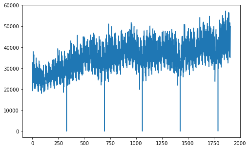
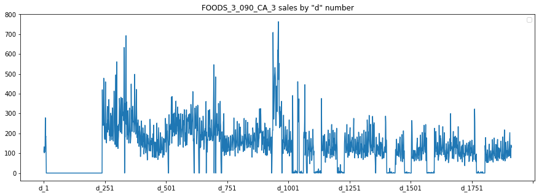
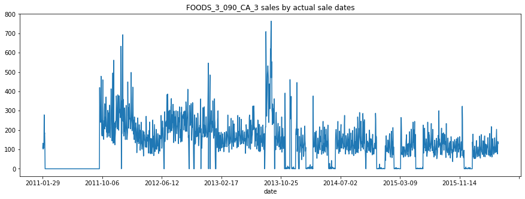
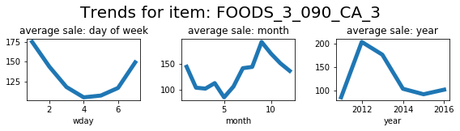
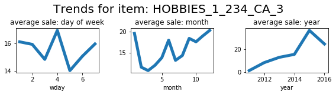
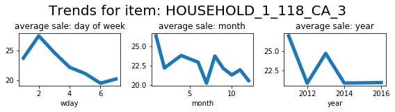
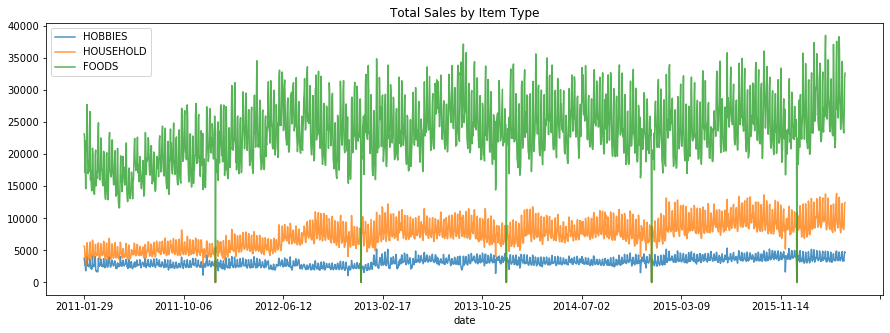
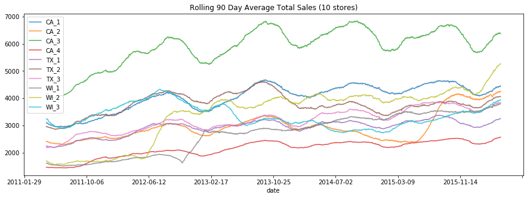
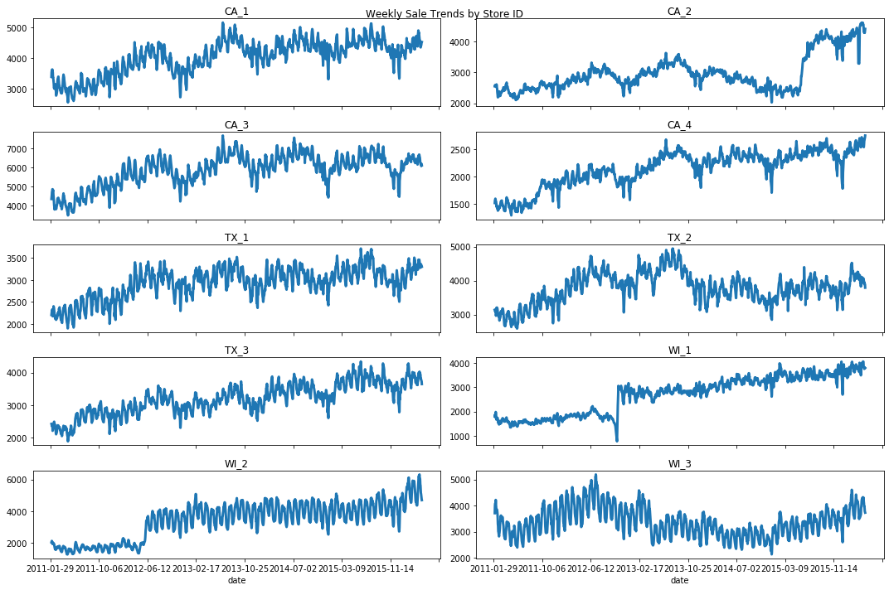

# Title


```
import pandas as pd
import matplotlib.pyplot as plt
import numpy as np
```

```
df = pd.read_csv('m5/m5-forecasting-accuracy/sales_train_validation.csv')
df.head()
```


<div>
<style scoped>
    .dataframe tbody tr th:only-of-type {
        vertical-align: middle;
    }

    .dataframe tbody tr th {
        vertical-align: top;
    }

    .dataframe thead th {
        text-align: right;
    }
</style>
<table border="1" class="dataframe">
  <thead>
    <tr style="text-align: right;">
      <th></th>
      <th>id</th>
      <th>item_id</th>
      <th>dept_id</th>
      <th>cat_id</th>
      <th>store_id</th>
      <th>state_id</th>
      <th>d_1</th>
      <th>d_2</th>
      <th>d_3</th>
      <th>d_4</th>
      <th>...</th>
      <th>d_1904</th>
      <th>d_1905</th>
      <th>d_1906</th>
      <th>d_1907</th>
      <th>d_1908</th>
      <th>d_1909</th>
      <th>d_1910</th>
      <th>d_1911</th>
      <th>d_1912</th>
      <th>d_1913</th>
    </tr>
  </thead>
  <tbody>
    <tr>
      <th>0</th>
      <td>HOBBIES_1_001_CA_1_validation</td>
      <td>HOBBIES_1_001</td>
      <td>HOBBIES_1</td>
      <td>HOBBIES</td>
      <td>CA_1</td>
      <td>CA</td>
      <td>0</td>
      <td>0</td>
      <td>0</td>
      <td>0</td>
      <td>...</td>
      <td>1</td>
      <td>3</td>
      <td>0</td>
      <td>1</td>
      <td>1</td>
      <td>1</td>
      <td>3</td>
      <td>0</td>
      <td>1</td>
      <td>1</td>
    </tr>
    <tr>
      <th>1</th>
      <td>HOBBIES_1_002_CA_1_validation</td>
      <td>HOBBIES_1_002</td>
      <td>HOBBIES_1</td>
      <td>HOBBIES</td>
      <td>CA_1</td>
      <td>CA</td>
      <td>0</td>
      <td>0</td>
      <td>0</td>
      <td>0</td>
      <td>...</td>
      <td>0</td>
      <td>0</td>
      <td>0</td>
      <td>0</td>
      <td>0</td>
      <td>1</td>
      <td>0</td>
      <td>0</td>
      <td>0</td>
      <td>0</td>
    </tr>
    <tr>
      <th>2</th>
      <td>HOBBIES_1_003_CA_1_validation</td>
      <td>HOBBIES_1_003</td>
      <td>HOBBIES_1</td>
      <td>HOBBIES</td>
      <td>CA_1</td>
      <td>CA</td>
      <td>0</td>
      <td>0</td>
      <td>0</td>
      <td>0</td>
      <td>...</td>
      <td>2</td>
      <td>1</td>
      <td>2</td>
      <td>1</td>
      <td>1</td>
      <td>1</td>
      <td>0</td>
      <td>1</td>
      <td>1</td>
      <td>1</td>
    </tr>
    <tr>
      <th>3</th>
      <td>HOBBIES_1_004_CA_1_validation</td>
      <td>HOBBIES_1_004</td>
      <td>HOBBIES_1</td>
      <td>HOBBIES</td>
      <td>CA_1</td>
      <td>CA</td>
      <td>0</td>
      <td>0</td>
      <td>0</td>
      <td>0</td>
      <td>...</td>
      <td>1</td>
      <td>0</td>
      <td>5</td>
      <td>4</td>
      <td>1</td>
      <td>0</td>
      <td>1</td>
      <td>3</td>
      <td>7</td>
      <td>2</td>
    </tr>
    <tr>
      <th>4</th>
      <td>HOBBIES_1_005_CA_1_validation</td>
      <td>HOBBIES_1_005</td>
      <td>HOBBIES_1</td>
      <td>HOBBIES</td>
      <td>CA_1</td>
      <td>CA</td>
      <td>0</td>
      <td>0</td>
      <td>0</td>
      <td>0</td>
      <td>...</td>
      <td>2</td>
      <td>1</td>
      <td>1</td>
      <td>0</td>
      <td>1</td>
      <td>1</td>
      <td>2</td>
      <td>2</td>
      <td>2</td>
      <td>4</td>
    </tr>
  </tbody>
</table>
<p>5 rows × 1919 columns</p>
</div>


```
sales_df = pd.read_csv('m5/m5-forecasting-accuracy/sell_prices.csv')
sales_df.head()
```


<div>
<style scoped>
    .dataframe tbody tr th:only-of-type {
        vertical-align: middle;
    }

    .dataframe tbody tr th {
        vertical-align: top;
    }

    .dataframe thead th {
        text-align: right;
    }
</style>
<table border="1" class="dataframe">
  <thead>
    <tr style="text-align: right;">
      <th></th>
      <th>store_id</th>
      <th>item_id</th>
      <th>wm_yr_wk</th>
      <th>sell_price</th>
    </tr>
  </thead>
  <tbody>
    <tr>
      <th>0</th>
      <td>CA_1</td>
      <td>HOBBIES_1_001</td>
      <td>11325</td>
      <td>9.58</td>
    </tr>
    <tr>
      <th>1</th>
      <td>CA_1</td>
      <td>HOBBIES_1_001</td>
      <td>11326</td>
      <td>9.58</td>
    </tr>
    <tr>
      <th>2</th>
      <td>CA_1</td>
      <td>HOBBIES_1_001</td>
      <td>11327</td>
      <td>8.26</td>
    </tr>
    <tr>
      <th>3</th>
      <td>CA_1</td>
      <td>HOBBIES_1_001</td>
      <td>11328</td>
      <td>8.26</td>
    </tr>
    <tr>
      <th>4</th>
      <td>CA_1</td>
      <td>HOBBIES_1_001</td>
      <td>11329</td>
      <td>8.26</td>
    </tr>
  </tbody>
</table>
</div>


```
calender_df = pd.read_csv('m5/m5-forecasting-accuracy/calendar.csv')
calender_df.head()
```


<div>
<style scoped>
    .dataframe tbody tr th:only-of-type {
        vertical-align: middle;
    }

    .dataframe tbody tr th {
        vertical-align: top;
    }

    .dataframe thead th {
        text-align: right;
    }
</style>
<table border="1" class="dataframe">
  <thead>
    <tr style="text-align: right;">
      <th></th>
      <th>date</th>
      <th>wm_yr_wk</th>
      <th>weekday</th>
      <th>wday</th>
      <th>month</th>
      <th>year</th>
      <th>d</th>
      <th>event_name_1</th>
      <th>event_type_1</th>
      <th>event_name_2</th>
      <th>event_type_2</th>
      <th>snap_CA</th>
      <th>snap_TX</th>
      <th>snap_WI</th>
    </tr>
  </thead>
  <tbody>
    <tr>
      <th>0</th>
      <td>2011-01-29</td>
      <td>11101</td>
      <td>Saturday</td>
      <td>1</td>
      <td>1</td>
      <td>2011</td>
      <td>d_1</td>
      <td>NaN</td>
      <td>NaN</td>
      <td>NaN</td>
      <td>NaN</td>
      <td>0</td>
      <td>0</td>
      <td>0</td>
    </tr>
    <tr>
      <th>1</th>
      <td>2011-01-30</td>
      <td>11101</td>
      <td>Sunday</td>
      <td>2</td>
      <td>1</td>
      <td>2011</td>
      <td>d_2</td>
      <td>NaN</td>
      <td>NaN</td>
      <td>NaN</td>
      <td>NaN</td>
      <td>0</td>
      <td>0</td>
      <td>0</td>
    </tr>
    <tr>
      <th>2</th>
      <td>2011-01-31</td>
      <td>11101</td>
      <td>Monday</td>
      <td>3</td>
      <td>1</td>
      <td>2011</td>
      <td>d_3</td>
      <td>NaN</td>
      <td>NaN</td>
      <td>NaN</td>
      <td>NaN</td>
      <td>0</td>
      <td>0</td>
      <td>0</td>
    </tr>
    <tr>
      <th>3</th>
      <td>2011-02-01</td>
      <td>11101</td>
      <td>Tuesday</td>
      <td>4</td>
      <td>2</td>
      <td>2011</td>
      <td>d_4</td>
      <td>NaN</td>
      <td>NaN</td>
      <td>NaN</td>
      <td>NaN</td>
      <td>1</td>
      <td>1</td>
      <td>0</td>
    </tr>
    <tr>
      <th>4</th>
      <td>2011-02-02</td>
      <td>11101</td>
      <td>Wednesday</td>
      <td>5</td>
      <td>2</td>
      <td>2011</td>
      <td>d_5</td>
      <td>NaN</td>
      <td>NaN</td>
      <td>NaN</td>
      <td>NaN</td>
      <td>1</td>
      <td>0</td>
      <td>1</td>
    </tr>
  </tbody>
</table>
</div>


## Total Sales

```
total_sales = df.sum().tolist()[6:]
```

```
plt.figure(figsize=(8,5))
plt.plot(np.arange(len(total_sales)),total_sales)
plt.show()
```





```
d_cols = [c for c in df.columns if 'd_' in c] 
plt.figure(figsize=(8,5))
df.loc[df['id'] == 'FOODS_3_090_CA_3_validation'] \
    .set_index('id')[d_cols] \
    .T \
    .plot(figsize=(15, 5),
          title='FOODS_3_090_CA_3 sales by "d" number')

plt.legend('')
plt.show()


```


    <Figure size 576x360 with 0 Axes>





```
example = df.loc[df['id'] == 'FOODS_3_090_CA_3_validation'][d_cols].T
example = example.rename(columns={8412:'FOODS_3_090_CA_3'}) # Name it correctly
example = example.reset_index().rename(columns={'index': 'd'}) # make the index "d"
example = example.merge(calender_df, how='left', validate='1:1')
example.set_index('date')['FOODS_3_090_CA_3'] \
    .plot(figsize=(15, 5),
          title='FOODS_3_090_CA_3 sales by actual sale dates')
plt.show()

```





```
example2 = df.loc[df['id'] == 'HOBBIES_1_234_CA_3_validation'][d_cols].T
example2 = example2.rename(columns={6324:'HOBBIES_1_234_CA_3'}) # Name it correctly
example2 = example2.reset_index().rename(columns={'index': 'd'}) # make the index "d"
example2 = example2.merge(calender_df, how='left', validate='1:1')

example3 = df.loc[df['id'] == 'HOUSEHOLD_1_118_CA_3_validation'][d_cols].T
example3 = example3.rename(columns={6776:'HOUSEHOLD_1_118_CA_3'}) # Name it correctly
example3 = example3.reset_index().rename(columns={'index': 'd'}) # make the index "d"
example3 = example3.merge(calender_df, how='left', validate='1:1')
```

```
examples = ['FOODS_3_090_CA_3','HOBBIES_1_234_CA_3','HOUSEHOLD_1_118_CA_3']
example_df = [example, example2, example3]
for i in [0, 1, 2]:
    fig, (ax1, ax2, ax3) = plt.subplots(1, 3, figsize=(8, 2))
    example_df[i].groupby('wday').mean()[examples[i]] \
        .plot(kind='line',
              title='average sale: day of week',
              lw=5,
              ax=ax1)
    example_df[i].groupby('month').mean()[examples[i]] \
        .plot(kind='line',
              title='average sale: month',
              lw=5,
              ax=ax2)
    example_df[i].groupby('year').mean()[examples[i]] \
        .plot(kind='line',
              lw=5,
              title='average sale: year',
              ax=ax3)
    fig.suptitle(f'Trends for item: {examples[i]}',
                 size=20,
                 y=1.1)
    plt.tight_layout()
    plt.show()
```











```
past_sales = df.set_index('id')[d_cols] \
    .T \
    .merge(calender_df.set_index('d')['date'],
           left_index=True,
           right_index=True,
            validate='1:1') \
    .set_index('date')


for i in df['cat_id'].unique():
    items_col = [c for c in past_sales.columns if i in c]
    past_sales[items_col] \
        .sum(axis=1) \
        .plot(figsize=(15, 5),
              alpha=0.8,
              title='Total Sales by Item Type')
plt.legend(df['cat_id'].unique())
plt.show()
```





```
store_list = sales_df['store_id'].unique()
for s in store_list:
    store_items = [c for c in past_sales.columns if s in c]
    past_sales[store_items] \
        .sum(axis=1) \
        .rolling(90).mean() \
        .plot(figsize=(15, 5),
              alpha=0.8,
              title='Rolling 90 Day Average Total Sales (10 stores)')
plt.legend(store_list)
plt.show()
```





```
fig, axes = plt.subplots(5, 2, figsize=(15, 10), sharex=True)
axes = axes.flatten()
ax_idx = 0
for s in store_list:
    store_items = [c for c in past_sales.columns if s in c]
    past_sales[store_items] \
        .sum(axis=1) \
        .rolling(7).mean() \
        .plot(alpha=1,
              ax=axes[ax_idx],
              title=s,
              lw=3)
    ax_idx += 1
# plt.legend(store_list)
plt.suptitle('Weekly Sale Trends by Store ID')
plt.tight_layout()
plt.show()

```




